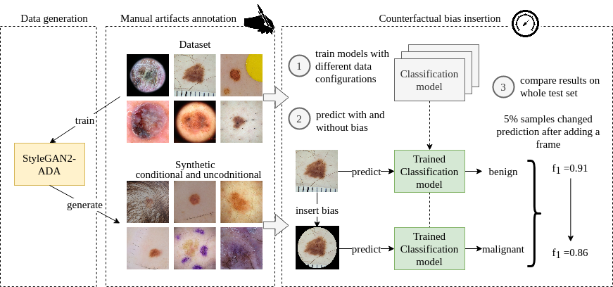
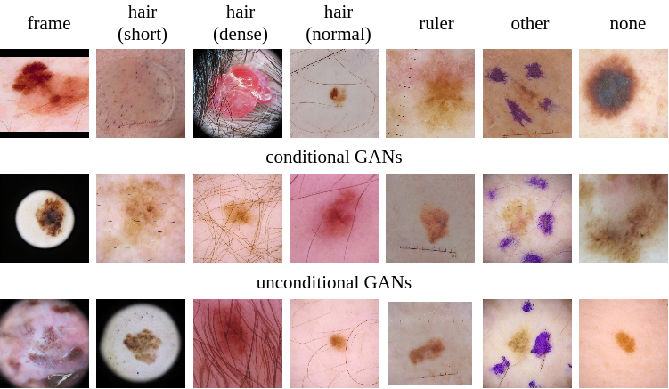

# The (de)biasing effect of GAN-based augmentation methods on skin lesion images

The main goal of the experiments was to examine if GAN-generated data makes classification models more prone to biases. We selected a skin lesion ISIC dataset for distinguishing between malignant and benign lesions.

Generated data, annotations and additionall results can be downloaded [here](https://drive.google.com/drive/folders/1ib7b5sopgUEK9TxqEPhgjD7XEdZXBvuV?usp=sharing)

Our procedure consists of three main steps: data generation, manual artifacts annotation and counterfactual bias insertion. The steps are below:



## Synthetic data generation and classification

Image generation was performed using the StyleGAN2-ADA modified implementation from NVIDIA Research group, which is available on GitHub repository: [https://github.com/aidotse/stylegan2-ada-pytorch](https://github.com/aidotse/stylegan2-ada-pytorch).

The conditional GAN (cGAN) for 2 classes and unconditional GAN (for each class separately) training and validation procedure consists of following steps:
1. [Preparing ISIC 2020 dataset](https://github.com/aidotse/stylegan2-ada-pytorch#preparing-datasets)
    
    In case of cGAN training, during dataset preparation, also file called 'dataset.json' that should be placed at the dataset root folder, has to be created.  
    This file has the following structure:
    ```json
        {
            "labels": [
                ["ISIC_0000002.jpg",1],
                ["ISIC_0000004.jpg",1],
                ... repeated for every image in the datase
                ["ISIC_9998240.jpg.jpg",0]
            ]
        }
    ```
    0 or 1 label indicates the bening or malignant class, respectively. 
    If the 'dataset.json' file cannot be found, the dataset is interpreted as not containing class labels.
2. [SyleGAN2-ADA training with or without additional labels](https://github.com/aidotse/stylegan2-ada-pytorch#training-new-networks---nvidia-resources)
   ```bash
   python train.py --outdir=~/training-runs --data=~/mydataset.zip --gpus=1          % unconditional example
   python train.py --outdir=~/training-runs --data=~/mydataset.zip --gpus=1 --cond=1 % conditional example
   ```
3. [EfficientNet-B2 training using only real, real+artificial and only artificial data](https://github.com/aidotse/stylegan2-ada-pytorch#classification-with-efficientnet-b2)
   
   Example with training using mixed real and synthetic data with 0 images of artificial bening samples and 15k images of malignant samples:
   ```
   python melanoma_classifier.py --syn_data_path=~/generated/  \
    --real_data_path=~/melanoma-external-malignant-256/ \
    --synt_n_imgs="0,15"
   ```
4. [Making predictions with trained classifier on real data](https://github.com/aidotse/stylegan2-ada-pytorch/blob/main/predict.py)
   ```
   python predict.py --data_path=~/melanoma-external-malignant-256/ \
    --model_path=classifier_efficientnet-b2_nonconditional_train_reals+15melanoma.pth \
    --seeds 0-24999
   ```

## Annotated examples

Based on the literature, we selected four types of artifacts for annotations: hair, frames, rulers and other.

* Hair is defined as thick and thin hair of various colors, from light blond to black. Additionally, we annotated  hair types: normal, dense (covering a significant part of an image) and short (shaved hair).
* Frames are black and white round markings around the skin lesion, black rectangle edges, and vignettes. 
* Rulers can come in different shapes and colors, either fully or partially visible. 
* Other are any other artifacts visible that are not as common as ruler marks, frames, and hair. It includes dermatoscopic gel or air bubbles, ink or surgical pen markings, patches and papers, dates and numbers, background parts, light reflection, and dust.


The annotation process was carried out by a trained professional working with the ISIC collection and identification of its biases for over 4 years. Additionally, we measured Inter-Annotator Agreement on a small subsample of data. The mean Cohen’s kappa coefficient was over 70%, with the highest values on ruler annotations and lowest on the other.

## Inheritance bias in GANs

Bias is often defined as a systematic error from erroneous assumptions in the learning algorithm. In this work, we focused primarily on bias in data and models. With the term 'bias in data,' we refer to four common data biases in machine learning (ML): 
* observer bias which might appear when annotators use personal opinion to label data
* sampling bias when not all samples have the same sampling probability [[N. Mehrabi et al.]](https://dl.acm.org/doi/abs/10.1145/3457607);
* data handling bias when the way of handling the data distort the classifier's output;
* instrument bias meaning imperfections in the instrument or method used to collect the data.
  
By 'bias in models', we refer to the broad term of the algorithmic bias. Some sources define an algorithmic bias as amplifying existing inequities in, e.g., socioeconomic status, race, or ethnic background by an algorithm.



## Descriptive statistics

Descriptive statistics indicated that GANs amplified strong biases: large black frames, common dermoscopy artifacts, were never generated in benign skin lesions but were more prevalent in the generated dataset than in the original one. At the same time, the amount of clean images was much higher in the case of synthetic images. This observation and the manual exploration of generated artifacts implied that GANs also have debiasing properties, especially in the case of small, rare biases. 
In addition, for better reproducibility of our studies we provided manual annotations of biasing artifacts, which can serve as a benchmark for further studies. Future directions will be focused on generating unbiased data by learning directions for each of the biases in the latent space, to create a more complex, fair and diverse dataset. 

|      	| class 	| hair (normal) 	| hair (dense) 	| hair (short) 	| ruler 	| frame 	| other 	| none 	| total 	|
|------	|-------	|---------------	|--------------	|--------------	|-------	|-------	|-------	|------	|-------	|
| Real 	| ben   	|      467      	|      110     	|      45      	|  211  	|   57  	|  201  	|  269 	|  1000 	|
|      	| mal   	|      444      	|      50      	|      51      	|  287  	|  251  	|  402  	|  141 	|  1000 	|
| cGAN 	| ben   	|      319      	|      57      	|       8      	|  186  	|   84  	|  106  	|  352 	|  1000 	|
|      	| mal   	|      223      	|      29      	|       8      	|  110  	|  365  	|  128  	|  328 	|  1000 	|
| GAN  	| ben   	|      190      	|      43      	|       4      	|   94  	|   78  	|  257  	|  412 	|  1000 	|
|      	| mal   	|      234      	|      40      	|      16      	|   41  	|  381  	|  197  	|  289 	|  1000 	|

## Counterfactual bias insertion 

The counterfactual bias insertion analysis supported the theory of GANs (de)biasing attributes. The study demonstrated an inverted correlation between the model's accuracy and bias robustness. This suggested that a well-trained model, even on biased data, is less likely to switch predictions after inserting biases. Ultimately, the best results in terms of accuracy and robustness were achieved for models trained on real data, or augmented with synthetic images produced by unconditional GANs. This shows that GANs can be successfully used to enrich data but should be monitored, as they can amplify preexisting inequities in data.

| bias   	| data     	|   switched   	|                	|              	|                      	|                      	|   F_1 (%)   	|                	|               	|                	|
|-----------------	|-------------------	|:------------:	|---------------:	|-------------:	|---------------------:	|---------------------:	|:--------------:	|---------------:	|--------------:	|---------------:	|
|        	|          	|         mean 	|        std 	|       median 	|           mal to ben 	|           ben to mal 	| F_1 	|            aug 	|       std 	|           mean 	|
| frame  	| real              	|          129 	|         119.39 	|           77 	|          24 (2.39%) 	|         104 (1.60%) 	|          91.99 	|          88.97 	|          4.01 	|          90.48 	|
|                 	| aug. cGAN         	|          223 	|          55.25 	|          199 	|          40 (3.88%) 	|         183 (2.81%) 	|          89.65 	|          84.93 	|          2.26 	|          87.29 	|
|        	| aug. GAN 	|  59 	|          16.07 	|  51 	| 22 (2.19%) 	| 37 (0.57%) 	| 91.52 	| 90.49 	|          0.61 	| 91.01 	|
|                 	| synth. cGAN       	|          290 	|          43.97 	|          271 	|        125 (12.24%) 	|         165 (2.54%) 	|          80.39 	|          79.28 	|          1.26 	|          79.84 	|
|                 	| synth. GAN        	|          413 	|          33.17 	|          404 	|        297 (29.13%) 	|         116 (1.78%) 	|          76.04 	|          74.99 	|          0.82 	|          75.51 	|
| ruler  	| real     	|  81 	| 86.76 	|  29 	| 76 (7.48%) 	|  5 (0.07%) 	| 91.99 	| 88.59 	| 4.30 	| 90.29 	|
|                 	| aug. cGAN         	|           79 	|          44.21 	|           69 	|          55 (5.43%) 	|          24 (0.37%) 	|          89.65 	|          89.18 	|          1.08 	|          89.41 	|
|                 	| aug. GAN          	|           81 	|          96.08 	|           24 	|          78 (7.60%) 	|           3 (0.05%) 	|          91.52 	|          87.05 	|          5.81 	|          89.29 	|
|                 	| synth. cGAN       	|          200 	|         137.26 	|          151 	|        194 (18.96%) 	|           6 (0.09%) 	|          80.39 	|          78.31 	|          5.11 	|          79.35 	|
|                 	| synth. GAN        	|          154 	|         109.89 	|          107 	|          65 (6.33%) 	|          90 (1.38%) 	|          76.04 	|          74.69 	|          1.82 	|          75.36 	|
| dense  	| real     	| 109 	| 33.63 	| 118 	| 90 (8.81%) 	| 19 (0.29%) 	| 91.99 	| 88.42 	| 1.62 	| 90.20 	|
|                 	| aug. cGAN         	|          439 	|         269.40 	|          459 	|          96 (9.38%) 	|         344 (5.28%) 	|          89.65 	|          78.85 	|          9.04 	|          84.25 	|
|                 	| aug. GAN          	|          122 	|          28.48 	|          113 	|          74 (7.29%) 	|          48 (0.73%) 	|          91.52 	|          87.03 	|          1.42 	|          89.28 	|
|                 	| synth. cGAN       	|          325 	|          71.38 	|          357 	|        272 (26.66%) 	|          52 (0.81%) 	|          80.39 	|          80.00 	|          1.43 	|          80.20 	|
|                 	| synth. GAN        	|         1089 	|         651.43 	|         1101 	|          61 (5.97%) 	|       1028 (15.79%) 	|          76.04 	|          59.94 	|         10.27 	|          67.99 	|
| medium 	| real     	|  27 	|  7.37 	|  26 	| 17 (1.63%) 	| 10 (0.15%) 	| 91.99 	| 91.60 	| 0.14 	| 91.79 	|
|                 	| aug. cGAN         	|           74 	|          17.85 	|           74 	|          38 (3.74%) 	|          36 (0.55%) 	|          89.65 	|          89.31 	|          0.97 	|          89.48 	|
|                 	| aug. GAN          	|           28 	|           8.23 	|           26 	|          12 (1.19%) 	|          16 (0.25%) 	|          91.52 	|          91.11 	|          0.25 	|          91.32 	|
|                 	| synth. cGAN       	|          163 	|          47.93 	|          177 	|        113 (11.05%) 	|          50 (0.77%) 	|          80.39 	|          80.49 	|          1.84 	|          80.44 	|
|                 	| synth. GAN        	|          284 	|         141.58 	|          298 	|          46 (4.47%) 	|         238 (3.66%) 	|          76.04 	|          73.51 	|          3.20 	|          74.78 	|
| short  	| real              	|           77 	|          99.49 	|           38 	|          67 (6.52%) 	|          10 (0.16%) 	|          91.99 	|          88.72 	|          5.21 	|          90.35 	|
|                 	| aug. cGAN         	|          180 	|         114.84 	|          224 	|          12 (1.16%) 	|         168 (2.59%) 	|          89.65 	|          84.73 	|          3.56 	|          87.19 	|
|                 	| aug. GAN 	|  54 	| 50.91 	|  32 	| 37 (3.64%) 	| 17 (0.26%) 	| 91.52 	| 89.55 	| 2.40 	| 90.54 	|
|                 	| synth. cGAN       	|          249 	|         135.44 	|          282 	|        221 (21.67%) 	|          28 (0.43%) 	|          80.39 	|          78.80 	|          1.31 	|          79.60 	|
|                 	| synth. GAN        	|          380 	|         445.91 	|          191 	|          57 (5.62%) 	|         323 (4.96%) 	|          76.04 	|          70.36 	|          9.30 	|          73.20 	|


# Citing

Our results were accepted to publish at MICCAI 2022. Preprint is avaiable at arXiv: [The (de)biasing effect of GAN-based augmentation methods on skin lesion images](https://arxiv.org/abs/2206.15182)

```
@misc{https://doi.org/10.48550/arxiv.2206.15182,
  doi = {10.48550/ARXIV.2206.15182},
  url = {https://arxiv.org/abs/2206.15182},
  author = {Mikołajczyk, Agnieszka and Majchrowska, Sylwia and Limeros, Sandra Carrasco},
  title = {The (de)biasing effect of GAN-based augmentation methods on skin lesion images},
  publisher = {arXiv},
  year = {2022},
  }

```
